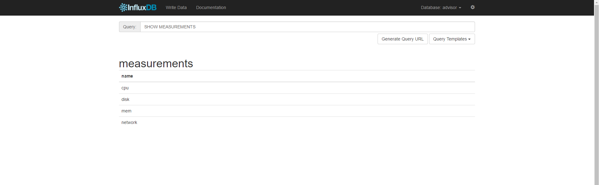
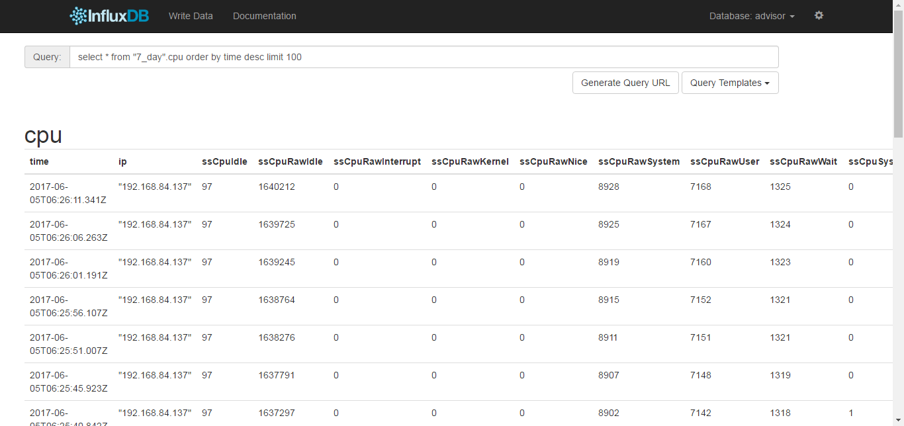
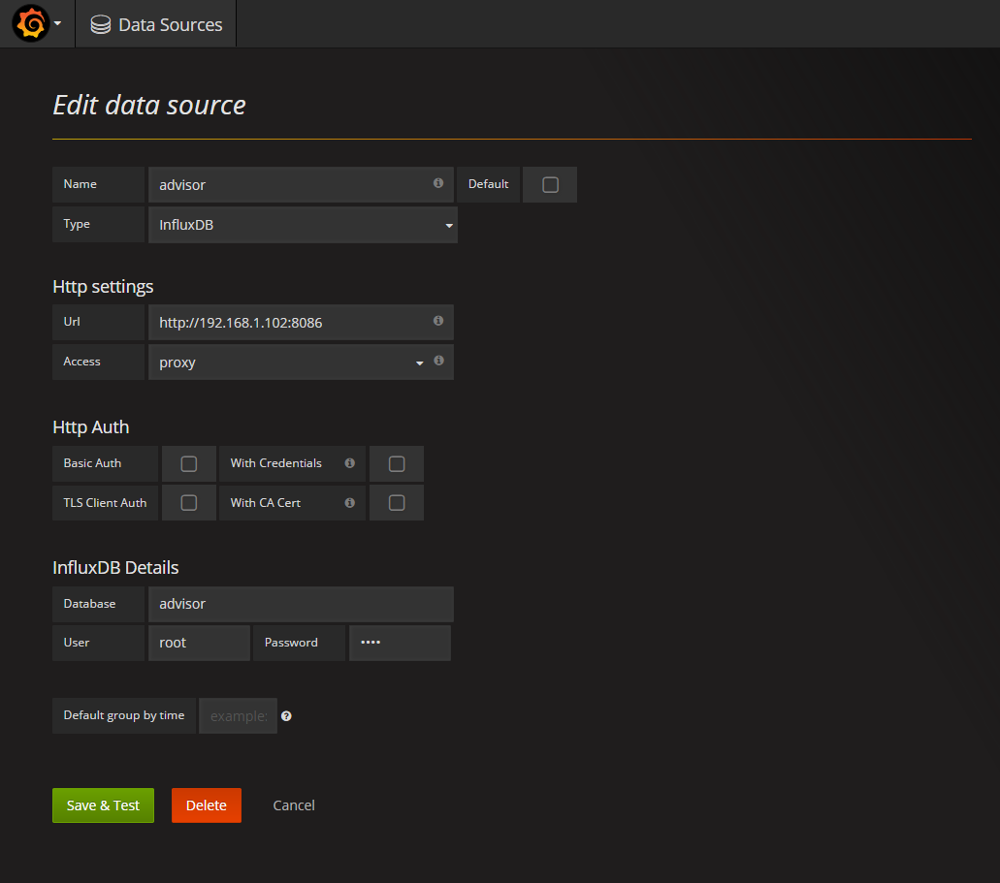
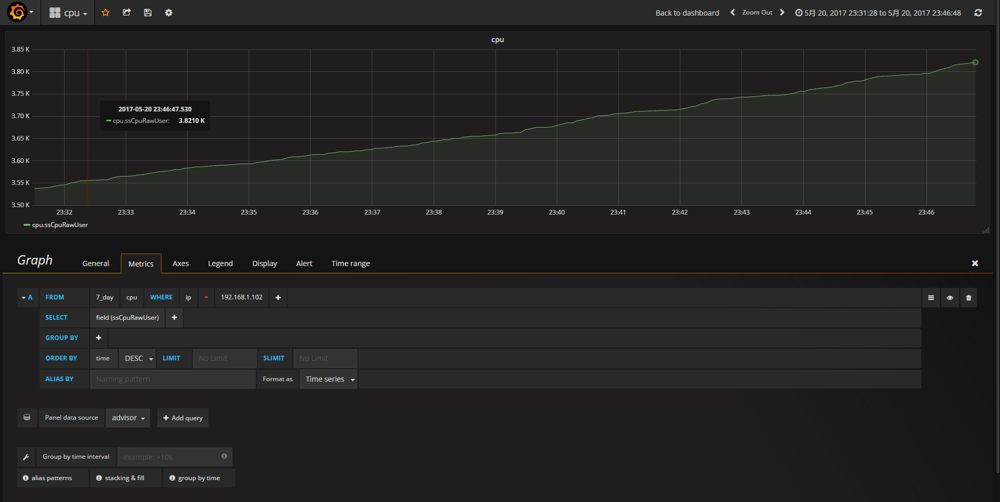

主机资源监控的方式多种多样，这里提供了一种方式：

利用net-snmp获取主机的各种参数到MIB中，然后采集这些参数到influxDB中，而数据的展示可以使用Grafana。

本程序完成从各个主机的MIB采集到influxDB的过程，以实现资源信息集中化。

为此，你需要在每台主机至少运行一个该程序。

关于net-snmp、influxDB、Grafana请自行搜索相关信息。

特点：
1. 简单轻巧
2. 异常自动重启

## 安装net-snmp工具：
<pre>
yum -y install net-snmp
</pre>

开启：
<pre>
systemctl start snmpd
</pre>

查看是否运行：
<pre>
netstat -ln | grep 161
</pre>

配置net-snmp：
<pre>
vi /etc/snmp/snmpd.conf
</pre>

为了测试，这里设置监控所有：
<pre>
# Make at least  snmpwalk -v 1 localhost -c public system fast again.
#       name           incl/excl     subtree         mask(optional)
#view    systemview    included   .1.3.6.1.2.1.1
#view    systemview    included   .1.3.6.1.2.1.25.1.1
view  all      included        .1
</pre>

tip：更详细的配置解释：http://www.linuxde.net/2013/02/12269.html

配置硬盘监控（使用df -l查看磁盘信息）：
<pre>
disk /
disk /boot
</pre>

重启snmpd:
<pre>
systemctl restart snmpd
</pre>

## 安装influxDB:
这里使用docker版本
<pre>
docker run -d -p 8083:8083 -p 8086:8086 --expose 8090 --expose 8099 --name influxsrv tutum/influxdb
</pre>

然后在浏览器中输入influxDB所在主机Ip及8083端口打开influxDB页面，例如：
<pre>
http://192.168.1.102:8083
</pre>

## 编译程序：
git clone 代码，然后cd到源程序根目录，使用Maven打包程序：
<pre>
mvn package
</pre>

不出意外，你将在此目录下的target包下发现 hostadvisor-1.0.jar 可执行文件。

打包程序之前，你可能要在源程序中配置一下信息（本人太懒，没有读配置文件）：
<pre>
String type = "test";                                     // test 为以下的默认值， pro 为读取系统的环境变量
String ip = "192.168.1.102";                              // 要采集主机的IP
String snmpPort = "161";                                  // 要采集主机的net-snmp端口，默认为161
String influxdb_url = "http://192.168.1.102:8086";        // influxDB的ip和端口
String influxdb_username = "root";                        // influxDB的用户名
String influxdb_password = "root";                        // influxDB的用户密码
String influxdb_dbname = "advisor";                       // influxDB的数据库名字
String policy = "7_day";                                  // influxDB保留策略的名字
String duration = "7d";                                   // influxDB保留策略的时间，这里是7天自动删除
String replication = "1";                                 // influxDB保留策略备份数量
String clear = "false";                                   // 每次启动是否清空数据库
int influxdbInterval = 5000;                              // 采集频率，单位毫秒
</pre>

使用以下命令执行程序：
<pre>
java -jar hostadvisor-1.0.jar
</pre>

日志打在运行目录的logs目录下。

当然，如果你想打成docker镜像，可以将type设置为pro，然后程序就会从系统环境变量中读取这些配置参数，而我就是这样做的。

最终在influxDB的相应数据库（上面设置的是advisor）中，你将看到cpu、disk、mem、network等MEASUREMENTS（表）。

查询cpu你将看到：

## 打docker镜像(可选)
将docker目录下的Dockerfile文件copy到target目录下，然后执行docker build命令：
<pre>
docker build -t="hostadvisor:v1" .
</pre>

启容器：
<pre>
docker run -ti \
 -e snmpPort=161 \
 -e influxdb_url=http://192.168.1.102:8086 \
 -e influxdb_username=root \
 -e influxdb_password=root \
 -e influxdb_dbname=advisor \
 -e influxdbInterval=5000 \
 -e policy=7_day \
 -e duration=7d \
 -e replication=1 \
 -e clear=false \
 -v /root/logs/:/logs/:rw \
 hostadvisor:v1
</pre>

日志挂载到/root/logs目录下。

## 安装Grafana
这里使用docker版本
<pre>
docker run -d -p 3000:3000 -e INFLUXDB_HOST=192.168.84.137  -e INFLUXDB_PORT=8086 -e INFLUXDB_NAME=cadvisor -e INFLUXDB_USER=root -e INFLUXDB_PASS=root --link influxsrv:influxsrv --name grafana grafana/grafana
</pre>

然后在浏览器中输入Grafana所在主机Ip及3000端口打开Grafana页面，例如：
<pre>
http://192.168.1.102:3000
</pre>

使用admin/admin进行登录，配置grafana：
1. Adding the data source ，在这个面板里配置Influxdb的连接信息（端口为8086），advisor数据库的认证信息(root/root)。

2. Adding Dashboards ,添加一个Graph，如下：

想看什么参数，就添加什么样的查询语句，就是如此的简单。