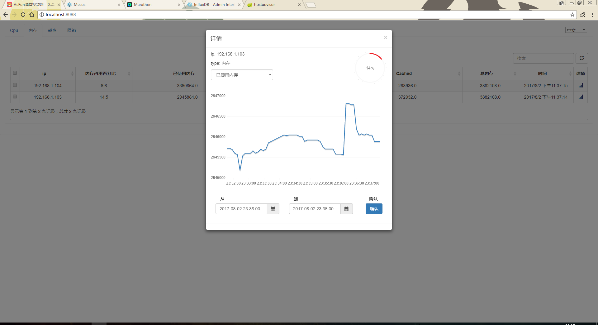

本分支是提供给hostadvisor采集程序的UI，请首先配置该采集程序。
## 编译程序：
git clone 代码，然后cd到源程序根目录，使用Maven打包程序：
<pre>
mvn package
</pre>

不出意外，你将在此目录下的target包下发现 hostadvisor-ui-1.0.jar 可执行文件。

打包程序之前，你可能要在源程序中配置一下信息（本人太懒，没有读配置文件）：

src\main\java\com\unicom\chanyi\startAdvisor\hostController.java

<pre>
String type = "test";                                     // test 为以下的默认值， pro 为读取系统的环境变量
String influxdb_url = "http://192.168.84.137:8086";       // influxDB的ip和端口
String influxdb_username = "root";                        // influxDB的用户名
String influxdb_password = "root";                        // influxDB的用户密码
String influxdb_dbname = "advisor";                       // influxDB的数据库名字
String influxdb_policy = "7_day";                         // influxDB保留策略的名字
</pre>

使用以下命令执行程序：
<pre>
java -jar hostadvisor-ui-1.0.jar
</pre>

默认使用8088端口，日志打在运行目录的logs目录下。

当然，如果你想打成docker镜像，可以将type设置为pro，然后程序就会从系统环境变量中读取这些配置参数，而我就是这样做的。

在浏览器中输入 IP:8088 ，出现以下界面。

## 打docker镜像(可选)
将docker目录下的Dockerfile文件copy到target目录下，然后执行docker build命令：
<pre>
docker build -t="hostadvisor-ui:v1" .
</pre>

启容器：
<pre>
docker run -ti \
 -e influxdb_url=http://192.168.84.137:8086 \
 -e influxdb_username=root \
 -e influxdb_password=root \
 -e influxdb_dbname=advisor \
 -e policy=7_day \
 -v /root/logs/:/logs/:rw \
 -p 8088:8088 \
 --expose 8088 \
 hostadvisor-ui:v1
</pre>

日志挂载到/root/logs目录下。